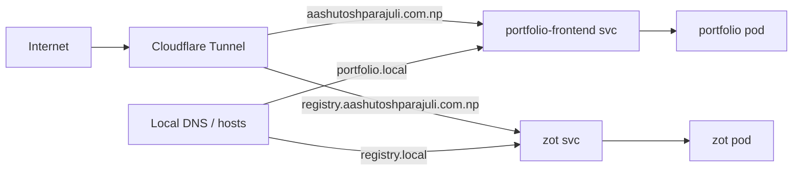

# k8s-homelab

GitOps-managed homelab Kubernetes manifests using Flux and Kustomize.

## Structure

- `clusters/homelab/` Flux Kustomizations that reconcile the repo.
  - `apps.yaml` applies everything in `./apps`.
  - `infrastructure.yaml` applies everything in `./infrastructure`.
- `apps/`
  - `portfolio/frontend` portfolio frontend deployment + service + ingress.
- `infrastructure/`
  - `cloudflared` Cloudflare Tunnel for public routing.
  - `zot` container registry with UI and basic auth.

## Apps

### Portfolio frontend

- Deployment `portfolio` runs `registry.aashutoshparajuli.com.np/portfolio/frontend:0.0.4` on port 3000.
- Service `portfolio-frontend` exposes port 80 -> 3000.
- Ingress host: `portfolio.local`.
- Pulls images using `zot-pull-secret` in `default` namespace.

### Zot registry

- Deployment `zot` on port 5000 with storage at `/var/lib/infrastructure/registry` (hostPath).
- Service `zot` exposes port 5000.
- Ingress host: `registry.local`.
- Uses `zot-htpasswd` secret for basic auth and `zot-config` for config.

### Cloudflared

- Deployment `cloudflared` with config from `cloudflared-config`.
- Routes:
  - `aashutoshparajuli.com.np` -> `portfolio-frontend.default.svc.cluster.local:80`
  - `registry.aashutoshparajuli.com.np` -> `zot.default.svc.cluster.local:5000`
- Uses `tunnel-credentials` secret.

## Prerequisites

- A Flux installation in the `flux-system` namespace.
- Secrets present in `default` namespace:
  - `tunnel-credentials` for Cloudflare Tunnel.
  - `zot-htpasswd` for registry auth.
  - `zot-pull-secret` for pulling images from the registry.

### Secret setup

Create the required secrets in the `default` namespace:

```bash
kubectl -n default create secret generic tunnel-credentials \
  --from-file=credentials.json=/path/to/credentials.json

kubectl -n default create secret generic zot-htpasswd \
  --from-file=htpasswd=/path/to/htpasswd

kubectl -n default create secret docker-registry zot-pull-secret \
  --docker-server=registry.aashutoshparajuli.com.np \
  --docker-username=pushuser \
  --docker-password=YOUR_PASSWORD \
  --docker-email=you@example.com
```

## Apply

Flux reconciles automatically based on the Kustomizations in `clusters/homelab/`.

If you need to reconcile manually, run:

```bash
flux reconcile kustomization apps -n flux-system
flux reconcile kustomization infrastructure -n flux-system
```

## Local access

- Add DNS or /etc/hosts entries for `portfolio.local` and `registry.local` pointing to your cluster ingress.

## Traffic flow


